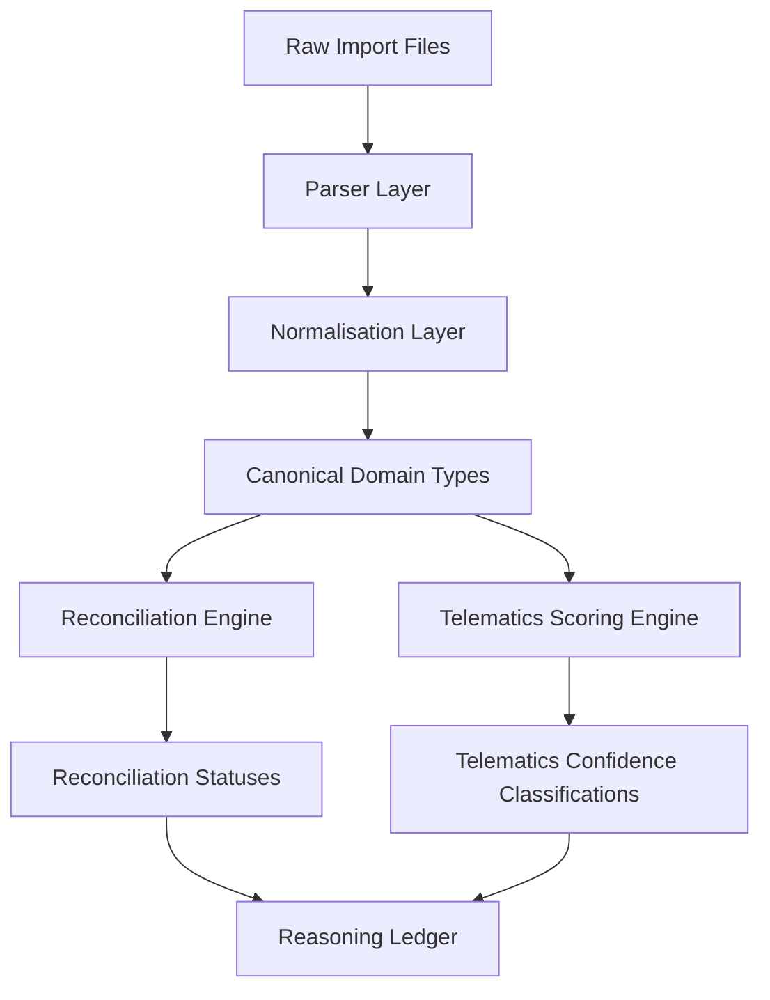

# Fuel Assurance System — Project Overview

The Fuel Assurance system is a comprehensive, production-grade fuel reconciliation and telematics validation platform designed to detect fuel card fraud, identify pricing variances, and automate the validation of invoicing records. By cross-referencing fuel transactions, invoices, GPS telematics, and station pricing master data, the system provides high-fidelity assurance that every litre of fuel billed was actually delivered to the correct vehicle, at the approved location, within the expected time window, and at the agreed price.

---

## 1. Product Purpose & Value Proposition

In commercial logistics and transport operations, fuel is typically one of the largest operating expenses. Fuel card networks (such as DKV and AS24) issue cards and on-board units (OBUs) to drivers and vehicles, generating a high volume of transactions. However, this environment is highly susceptible to leakage:
* **Fuel Card Fraud:** Cards can be cloned, stolen, or shared with unauthorized vehicles. A driver might fuel their private car or allow a third party to fuel their vehicle using a company card.
* **Pricing Variances:** Fuel card providers charge service fees, apply rebates, and use complex pricing sheets that change daily or weekly. Fleet operators often pay invoiced amounts blindly without validating against approved station master rates or contracted discounts.
* **Administrative Errors:** Discrepancies in quantity, tax rates (VAT), currencies, or timezones can lead to significant overpayment.

The Fuel Assurance system resolves these challenges by providing two automated assurance engines that ingest raw provider data and produce an auditable, immutable reasoning ledger of matches and discrepancies.

---

## 2. The Two Core Assurance Engines

The system is architected around two decoupled, deterministic engines:

### A. The Reconciliation Engine
The **Reconciliation Engine** matches transactions (pre-authorisations or real-time sales reports) against the final invoice lines issued by fuel card providers. 
* **Prioritized Matching:** It executes a 9-stage matching workflow, progressing from high-confidence matches (exact authorisation IDs) to composite matches (matching by vehicle registration, country, and time).
* **One-to-One Protection:** It prevents double-matching, ensuring that a single transaction cannot be matched to multiple invoice rows, or vice versa.
* **Quantity Tolerance:** It applies a configurable quantity tolerance (defaulting to **0.02 litres**) to accommodate minor rounding variances between pump meters and invoice systems. Importantly, this logic is restricted to liquid fuel products and is bypassed for non-fuel items (e.g., tolls, parking, washing).
* **Alignment Analysis:** It evaluates period overlap between transaction dates and invoice dates to isolate adjustment transactions and detect date drifts.

### B. The Telematics Scoring Engine
The **Telematics Scoring Engine** validates the physical reality of a transaction by comparing it against GPS telematics logs. Even if a transaction matches an invoice line perfectly, the telematics engine validates whether the vehicle was actually there:
* **Multi-Factor Scoring:** It computes a deterministic confidence score (0 to 100) based on six weighted dimensions:
  1. **Time Proximity (25%):** Was a GPS point recorded near the transaction timestamp?
  2. **Location Proximity (25%):** Did the vehicle's reported position match the station's city or address?
  3. **Fuel Level Movement (25%):** Did the vehicle's fuel tank sensor record an increase corresponding to the quantity purchased?
  4. **Stop/Engine Behaviour (10%):** Was the vehicle stationary and resting during the transaction window?
  5. **Volume Consistency (10%):** Does the fuel quantity exceed the physical tank capacity of the vehicle?
  6. **Odometer Consistency (5%):** Does the transaction's odometer reading align with the telematics log?
* **Confidence Classifications:** Transactions are classified into five auditable categories: `VERIFIED`, `LIKELY`, `REVIEW`, `UNLIKELY`, or `INSUFFICIENT_EVIDENCE`.
* **Product-Specific Exclusions:** The scoring engine applies context-specific rules. For example, AdBlue purchases are excluded from fuel tank increase checks, and parking/tolls are assessed without fuel level validation.

---

## 3. Supported Providers & Document Types

The platform supports ingestion and processing of data files from the two dominant European fuel card providers, as well as auxiliary telematics and master pricing data:

| Provider | Data Domain | File Format | Details / Variants |
| :--- | :--- | :--- | :--- |
| **DKV** | Transactions | XLSX | "Ola Reports" (Supports 12-column and 21-column variants) |
| **DKV** | Invoices | XLSX | "Invoice-Transactions Reports" (40 columns containing detailed base and net values) |
| **AS24** | Invoices & Tolls | PDF | Native PDF statements containing Statement, Cards Filling, and PASSango Toll sections |
| **GPS** | Telematics | XLS | Vehicle logs containing registrations, speed, odometer, fuel %, and text positions |
| **Stations** | Master Data | XLSX | Approved station listing with 3 sheets: `YARD_DKV`, `RED_DIESEL_AS24`, and `DIESEL_AS24` |

---

## 4. Key Design & Development Principles

To ensure production stability, auditability, and mathematical precision, the Fuel Assurance system is built upon the following design principles:

### I. Mathematical Integrity (No Float Hazards)
Binary floating-point arithmetic introduces rounding errors (e.g., `0.1 + 0.2 === 0.30000000000000004`). In a financial reconciliation system, this is unacceptable. All financial calculations, price multiplications, VAT additions, and discount deductions are performed using string-represented decimals consumed by **Decimal.js**.

### II. Schema Hardening & Drift Detection
Fuel card providers frequently change their spreadsheet templates, adding columns, renaming headers, or shifting rows. The system implements a **Schema Discovery Engine** that:
* Identifies header rows by scanning non-empty cells.
* Maps headers to canonical fields using a versioned **Column Alias Registry**.
* Generates a structural fingerprint for every file and calculates a **Drift Report** (classifying structural changes as `NONE`, `COSMETIC`, `MINOR`, `MAJOR`, or `BREAKING`).

### III. Decoupled Architecture (Parser Isolation)
Parsers only read raw input and output raw, unvalidated records. A separate **Normalisation Layer** converts raw records into canonical, type-safe domain models (`CanonicalTransaction`, `CanonicalInvoiceRow`, etc.). This isolates file format quirks (such as Excel serial dates, missing timezone headers, and regional text coordinates) from core reconciliation and scoring logic.

### IV. Auditable & Overridable Decisions
Machine-generated results are immutable. Every matched pair, scoring deduction, and financial variance is recorded in an auditable **Reasoning Ledger**. If a human auditor reviews an exception and manually overrides a status (e.g., approving an `UNLIKELY` transaction due to a documented sensor failure), the ledger stores the decision and reasoning while **preserving the original machine result** for continuous system tuning and audit retention.

### V. Strict Data Integrity
No coordinates or telemetry values are fabricated. If a GPS log contains text positions (e.g., city, street) but no latitude/longitude, the system performs text-based location matching rather than geocoding fake coordinates. Organization isolation is enforced at the database level using Supabase Row Level Security (RLS).
